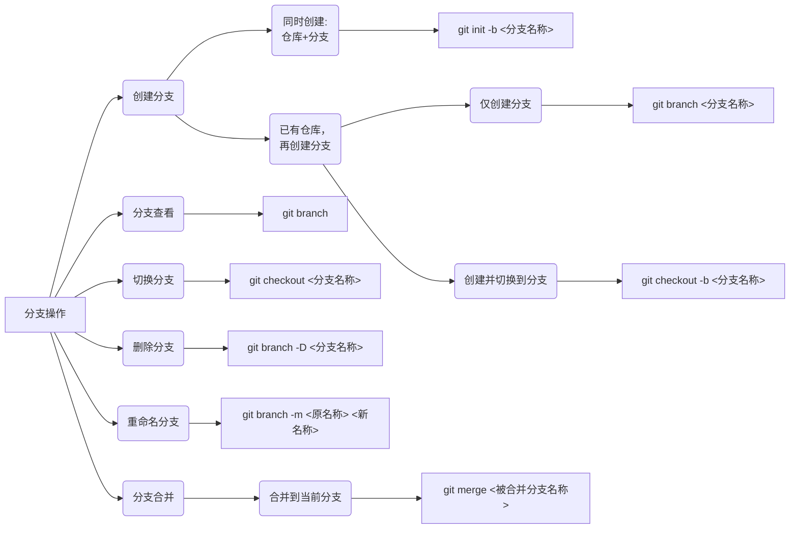



想用一杯Latte把你灌醉

好让你能多爱我一点



## 1.访问github并汉化

在微软商店安装**Watt Toolkit**可以直接加速github，然后用qq邮箱或其它邮箱都可以注册一下


搜索框搜索“chinese汉化”认准第一个star7.8k即可，然后安装油猴(Tampermonkey)插件，再安装汉化脚本。还有许多脚本可以安装。


进入文件夹右键打开选项卡，点击`用git bash打开`


## 2.安装和配置git

下载地址[git-scm.com](https://git-scm.com/)，[镜像下载地址](https://registry.npmmirror.com/binary.html?path=git-for-windows/)

#### 显示隐藏文件夹：


在VS code中显示隐藏文件夹只需要在设置里找到：Files:Exclude再把`**/.git`删除即可显示出来


## 3.git命令行配置

#### 初始化仓库过程用到的命令：

```bash
git -v
git init  #
git init -b main   #-b main 明确告诉 Git 将初始分支命名为 main。

git config --global user.name "你的名字"
git config --global user.email "你的邮箱"

git config --list #查看刚刚配置的用户名和邮箱
git config --global --list # 这个也可以查看配置信息
```


#### bash的基本操作

常用快捷键：

```bash
Ctrl + C 中断当前命令
Ctrl + L 或 clear: 清屏
Ctrl + A 移动光标到行头
Ctrl + E: 移动光标到行尾
Ctrl + U: 删除光标前的所有字符
Ctrl + K: 删除光标后的所有字符
Ctrl + W: 删除光标前的一个单词
Tab: 自动补全
↑ / ↓: 浏览历史命令
```

## 3.基础操作流程

#### 专业名词的理解


`git status`最常见的命令之一，初学者最好每一个命令就查看一下文件的状态.`git status -s`/`git status --short`是精简输出

```bash
echo "xxx" # 是将xxx输出到控制台，如果有空格的话要加引号
echo xxx > <file>  # 将xxx写入写入文件中，如果没有就创建一个
echo xxx >> <file>


git add xxx  # U > A
git add .
# A是已添加索引（会提示你git commit），U是未追踪文件（会提示你git add）

git commit -m "提交信息，要准确详细"
git commit     # 进入vim编辑器，编辑

git log 
git log -2 #只看最近两条
git log --oneline# 更简洁
```

#### 文件的删除（命令行）

```bash
git rm <file> # 从暂存区和工作区删除

git re -cached <file> # 只从暂存区中删除，工作区不变

git rm -f <file> # 强制删除文件，即使文件在工作区被修改

git rm -rf <directory> #递归删除所有文件和子目录

git commit -m "删除<file>"
```

> 删除后需要`git commit`提交，如果只是想从工作目区中删除文件，可以使用操作系统的删除命令（rm <file>）然后再使用`git add .`

#### 文件删除（IDE）


## 4.SSH秘钥的创建

生成秘钥（ed25519算法）：

```bash
ssh-keygen -t ed25519 -C "your_email@example.com"  
```

如果一些旧系统不支持ed25519算法的话，可以使用RSA

```bash
ssh-keygen -t rsa -b 4096 -C "your_email@example.com"
```

**第一次使用这个命令**一直回车即可

在用户文件夹里查看密钥对






添加公钥.pub文件复制粘贴至Github→ Settings → SSH Key，再连接测试一下：

```bash
ssh -T git@github.com
```

正常会报错：连接测试时出现：`ssh: connect to host github.com port 22: Connection timed out`通常是因为网络环境无法通过 **22 端口**连接到 GitHub 的 SSH 服务。可以通过以下步骤解决，官方文档为[通过HTTP端口使用SSH](https://docs.github.com/en/authentication/troubleshooting-ssh/using-ssh-over-the-https-port)

我们需要改HTTPS端口（443）使用SSH。方法为在生成的.ssh文件夹中添加配置文件

```bash
# 编辑 SSH 配置文件
vim ~/.ssh/config

# 配置文件内容：
Host github.com          # 别名，可以自定义
Hostname ssh.github.com   # GitHub SSH 的实际主机名
Port 443                # 使用 443 端口
User git                # 使用 git 用户
```


粘贴好后按Ecs再英文状态下的`:wq`保存退出，可以检查一下

再次测试时出现：`Hi username ! You've successfully authenticated, but GitHub does not provide shell access.`即成功了，我们就可以通过SSH克隆和推送仓库了


## 5.gitignore的实践

创建.gitignore文件：

```bash
# 将不需要推送的文件写入到.gitignore上
echo xxx > .gitignore
# xxx可以是字符串，文件，文件夹，第一次使用重定向符>
#如果已经用了.gitignore文件的话，就用>>追加符来添加新的文件或文件夹
printf ".xxx\n.xx\n" >> .gitignore
#前面的.表示在根目录下
```

常见的.gitignore文件包含：

```bash
# 忽略所有 .log 文件,但是保留error.log文件
*.log
!error.log

# 忽略 node_modules 目录
node_modules/

# 忽略特定文件
config.ini

# 不忽略某个文件(即使前面已经有忽略规则)
!important.log
```

> .gitignore 仅对**从未被 Git 跟踪过的文件**生效。若文件已被提交过，即使后续加入 .gitignore，仍需手动从 Git 中移除。此外，未跟踪但未忽略的文件仍可能导致分支污染，需定期检查工作目录状态（git status）

更多模版可以参考github上的项目：[gitignore](https://github.com/github/gitignore)

## 6.版本的回滚

```bash
# 查看HEAD
git log --oneliine --groph # 更加简洁的查看提交ID
git reflog  # 含已删除提交历史，可以快速找到提交ID

git diff HEAD <commit-id> # 对比差异

git reset --hard HEAD~1  # 彻底回退上一个提交
git reset --soft HEAD~1  # 保留修改但回退 commit
# HEAD~1一般就是提交ID前6个字母或数字
```

使用`git reset --hard`会重置工作目录到指定的提交，所有未提交的修改都会被删除。需要注意备份或暂存（`git stash`）这些更改，避免数据丢失。


## 7.首次推送的命令：

关键是：

* **添加远程仓库的 URL (Add Remote Origin**

* **推送本地分支到远程仓库 (Push to Remote):**

```bash
git remote add origin <你的GitHub仓库URL>
git remote -v #查看已配置的远程仓库信息

git push -u origin master #取决于是main还是master且第一次需要 -u

```

之后便可以

- 推送后续提交: **git push** (默认会推送当前分支到其追踪的远程分支)
- 拉取远程更新: **git pull** (默认会拉取远程追踪分支的更新并合并到当前分支)

## 8.深入分支

> 主分支包含了所有最终修改历史，建议不要乱动。因为你的改动会影响到其它在参与这个项目的人，很可能出现合并冲突。

| 常见分支                | 功能 |
| ----------------------- | ---- |
| develop（开发分支）dev  |      |
| feature（功能分支）feat |      |
| release（发布分支）     |      |
| hotfix（热修复分支）    |      |
| bugfix（缺陷分支）      |      |
| support（支持分支）     |      |

#### 本地分支




这里可能会出现一个幻觉：我在分支里创建的文件为什么主分支里也有？，不是说都是独立的吗？原因是**你未将新建的文件提交（commit）到分支中**。此时文件处于“未跟踪”状态（untracked）（即还没有add），切换分支时这些未提交的改动会保留在工作目录中，与分支无关。因为**未执行 `git add` 和 `git commit`**，所以`my.log` 未被记录到 Git 版本控制中。切换回 `master` 分支时，**未提交的改动（包括未跟踪文件）会保留在工作目录**，因此 `my.log` 仍然存在。

简单来说：

- **未提交文件**：游离于分支外，切换分支时保留。
- **提交后文件**：与分支绑定，切换分支时自动隔离。

当我们提交后：


这样主分支里就没有my.log了，就可以安心在分支里操作不用怕误操作主分支啦

**小总结**：未提交的文件（untracked files）**不属于任何分支**，它们会“跟随”你的工作目录。只有提交到分支后，文件才会与分支绑定。

接下来是在分支里修改了文件，如果不提交或保存的话**是不会让你切换的**


它会让你在切换之前进行`git commit`或`git stash`先暂时保存再`git stash pop`恢复


这样就可以在你的本地分支上安心的操作了


**在分支间共享某些文件**时（如配置文件），应通过 Git 的合并（`git merge`）或变基（`git rebase`）操作实现，而非手动复制文件。


执行删除操作的时候要格外小心
-d用于删除已合并过的分支，即已经被merge了
-D用于强制删除分支（不管是否合并过）

可以在在命令行中查看分支图`git log --graph --oneline --decorate --all`来可视化分支结构不过可能有一点抽象

#### 远程分支

```bash
git branch -a # 列出远程和本地分支，即所有分支

git push <远程仓库名称比如origin> <分支名称>  # 推送某个分支
git push <远程仓库名称> --all # 推送所有分支
 
git push <远程仓库名称> -d <分支名称>
```

在github上删除分支时的细节：

虽然在github上删除远程分支很简单，但是会导致本地库中缓存的远程分支与实际远程分支不一致。所以还要在git bash中同步远程分支执行：`git remote prune <远程仓库名称>`

**还有一些细节比如，回溯、打标签**

```bash
git checkout 提交ID(Commit ID)
git checkout 分支
git checkout tag

git tag # 查看标签
git tag -d xxx # 删除标签
```
